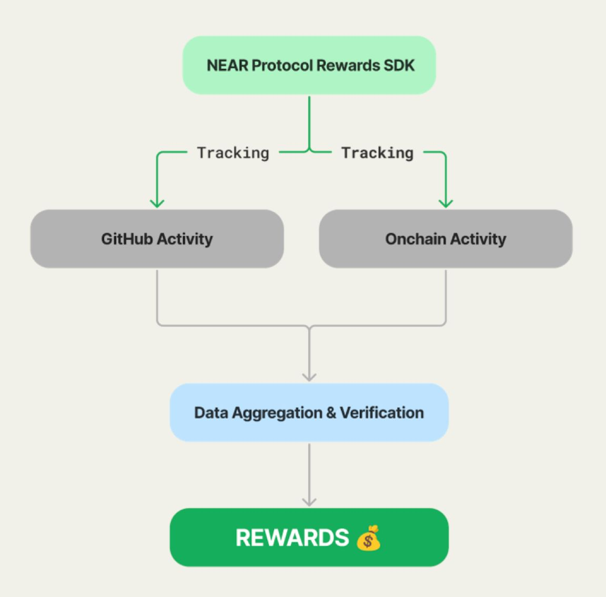

# NEAR Protocol Rewards Backend

> A transparent, metric-based rewards system for NEAR projects that directly ties incentives to development activity.

<div align="center">
  
  [](https://www.npmjs.com/package/near-protocol-rewards)
  [](https://www.typescriptlang.org/)
  [](https://opensource.org/licenses/MIT)
  [](https://github.com/jbarnes850/near-protocol-rewards/blob/main/CONTRIBUTING.md)

</div>

## What is Protocol Rewards?

Protocol Rewards is a developer-first funding solution for the NEAR ecosystem. We're solving a critical challenge in Web3: how to transform traditional one-time grants into sustainable, ongoing capital for developers - where funding automatically grows with their impact and contribution to NEAR.

### The Problem

- Traditional funding models (grants, VCs) require extensive time spent on proposals and pitches
- Developers want to focus on building, not fundraising
- Project impact is often measured subjectively
- Funding is typically front-loaded rather than tied to ongoing development

### Our Solution

Protocol Rewards provides:

- Automated tracking of development metrics and project impact
- Merit-based rewards tied directly to contributions
- Transparent, objective criteria for funding
- Sustainable, ongoing rewards that scale with project growth

By automating the entire process from tracking to distribution, we enable developers to focus on what they do best - building innovative solutions on NEAR.

## How It Works



We automatically track both off-chain and on-chain metrics:

### Off-Chain Metrics (GitHub)
- **Commits**: How often you code
- **Pull Requests**: How you integrate changes
- **Reviews**: How you help others
- **Issues**: How you manage tasks

### On-Chain Metrics (Blockchain)
- **Transaction Volume**: Total value of transactions on NEAR's Blockchain
- **Smart Contract Interactions**: Number of unique contract interactions
- **Unique Wallet Interactions**: Number of distinct wallets interacting

## Scoring System

The total score (0-100) is calculated from both off-chain (GitHub) and on-chain (Blockchain) contributions, with an 80/20 weight distribution:

### Off-Chain (GitHub) - 80 Points

| Component | Max Points | Description | Threshold for Max Points |
|-----------|--------|-------------|------------|
| Commits | 28 | Code contributions | 100 meaningful commits |
| Pull Requests | 22 | Code review and integration | 25 merged PRs |
| Reviews | 16 | Community participation | 30 substantive reviews |
| Issues | 14 | Project management | 30 closed issues |

### On-Chain (Blockchain) - 20 Points

| Component | Max Points | Description | Threshold for Max Points |
|-----------|--------|-------------|------------|
| Transaction Volume | 8 | Total value of transactions | $10,000+ |
| Smart Contract Calls | 8 | Number of unique calls | 500+ calls |
| Unique Wallets | 4 | Number of distinct wallets | 100+ unique wallets |

#### Reward Calculation

Monetary rewards are calculated based on the score, following the table below:

| Score Range | Tier | Monetary Reward |
|-------------|------|-----------------|
| 85–100 |  Diamond | $10,000 |
| 70–84 | Gold | $6,000 |
| 55–69 |  Silver | $3,000 |
| 40–54 |  Bronze | $1,000 |
| 20–39 |  Contributor | $500 |
| 1–19 |  Explorer | $100 |
| 0 | No Tier | $0 |

In the code we have this:
```
Calculates monetary reward based on score."""
    if score >= 85:
        return 10000  # Diamond: $10,000
    elif score >= 70:
        return 6000   # Gold: $6,000
    elif score >= 55:
        return 3000   # Silver: $3,000
    elif score >= 40:
        return 1000   # Bronze: $1,000
    elif score >= 20:
        return 500    # Contributor: $500
    elif score >= 1:
        return 100    # Explorer: $100
    else:
        return 0      # No tier: $0
```
## Validators

All collected data passes through a robust quality validation system before being processed. Both off-chain metrics (GitHub) and on-chain metrics (blockchain) undergo rigorous validations that ensure data integrity, accuracy, and authenticity. These validators verify everything from blockchain transaction validity to the quality of GitHub contributions, ensuring that only reliable data is used in reward calculations.

## Dashboard

You can view all your metrics on our [dashboard](https://www.nearprotocolrewards.com/dashboard). If you want to update your data, there's a "refresh" button that automatically triggers our backend to update your specific data in real-time.

## Offchain Data Collection

The offchain data collection module retrieves GitHub metrics for repositories, including:

- Commits
- Pull requests
- Reviews
- Issues

### Setup

1. Create a `.env` file in the root directory with your GitHub token:

```
GITHUB_TOKEN=your_github_token_here
```

2. Install dependencies:

```bash
npm install
```

### Usage

To collect GitHub metrics for repositories:

```bash
npm start
```

This will collect data for the current month. You can modify `src/index.ts` to specify different repositories or time periods.

### API

```typescript
// Create a collector
const collector = new OffchainCollector({
  token: 'your_github_token',
  repo: 'owner/repo',
  logger,      // Optional
  rateLimiter  // Optional
});

// Test connection
await collector.testConnection();

// Collect metrics for specific year and month
const year = 2025;
const month = 6; // June
const metrics = await collector.collectMetrics(year, month);

// Calculate rewards
const rewards = collector.calculateRewards(metrics);
```

## Common Questions

### When do metrics update?

- Every 12 hours automatically
- You can update your project on demand on the [dashboard](https://www.nearprotocolrewards.com/dashboard)

### Not seeing your metrics?

See our [Troubleshooting Guide](docs/troubleshooting.md)

### How can I change my data? (like repository link)

- You can open an Issue asking for changing the data. All the data is in src/data.json

### There is a limit on wallets and repositories?

- Yes! You can only register a maximum of 3 repositories and 1 wallets.

### How can I view my onchain data?

- You can use the NearBlocks Api following this example of link: https://nearblocks.io/token/exportdata?address=your-wallet-here

## Documentation

- [Quick Start Guide](docs/quick-start.md)
- [Troubleshooting Guide](docs/troubleshooting.md)
- [Dashboard Guide](docs/dashboard.md)
- [Rewards Structure](docs/rewards.md)
- [Development Roadmap](docs/roadmap.md)

## Need Help?

- [Report Issues](https://github.com/near-horizon/near-protocol-rewards/issues)
- [Dashboard Support](https://github.com/near-horizon/protocol-rewards-dashboard/issues)

## License

MIT © [NEAR Protocol](LICENSE)
