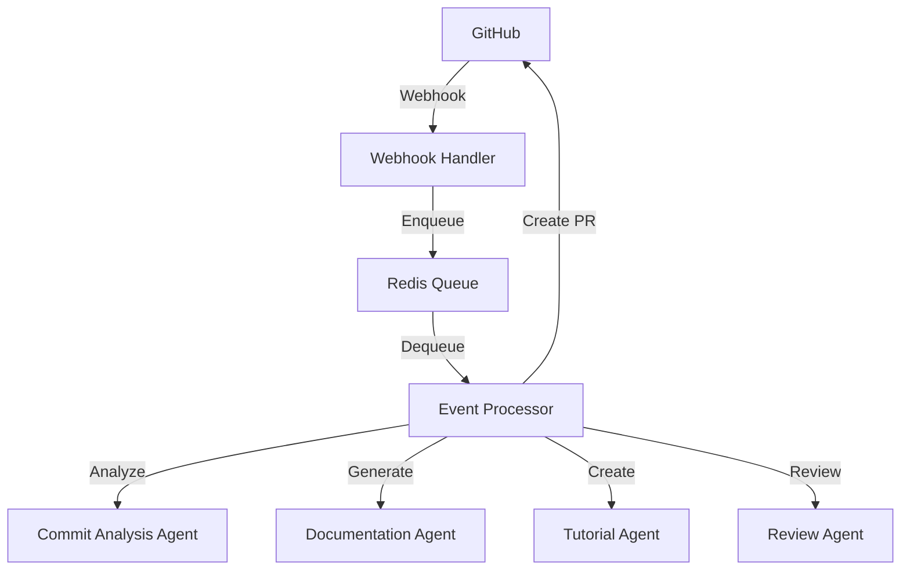
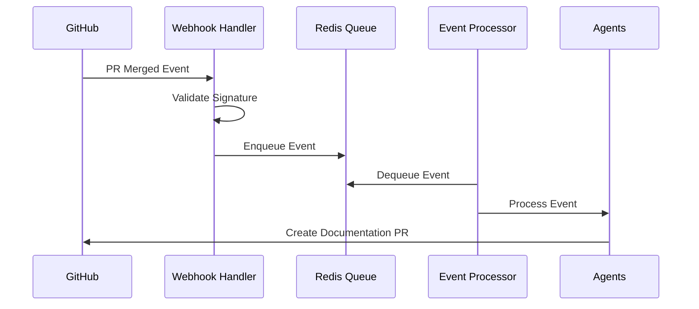
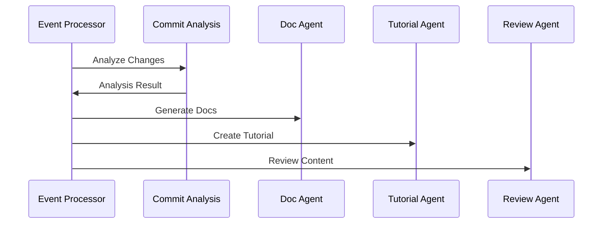
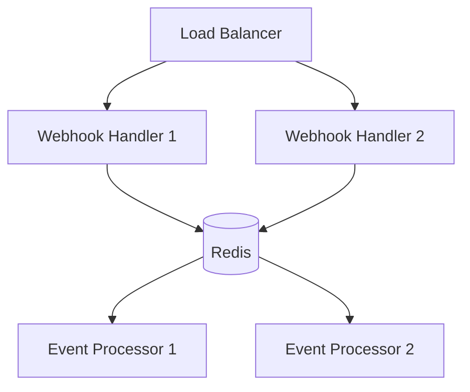

# Architecture Documentation

## System Overview

The Orc-Agent is a distributed system for automated documentation generation from GitHub pull requests. It uses a microservices architecture with event-driven processing.



## Components

### 1. Webhook Handler

**Purpose:** Receives and validates GitHub webhook events.

**Responsibilities:**
- Validate webhook signatures
- Parse pull request events
- Enqueue events for processing
- Handle rate limiting

**Technologies:**
- FastAPI for HTTP handling
- Redis for event queueing
- PyGithub for GitHub API integration

### 2. Event Queue

**Purpose:** Manages asynchronous event processing.

**Structure:**
```
Redis Keys:
- doc_agent:event_queue -> List of pending events
- doc_agent:processing -> Currently processing events
- doc_agent:failed -> Failed events
```

**Features:**
- FIFO event processing
- Event persistence
- Failure handling
- Concurrent processing

### 3. Event Processor

**Purpose:** Coordinates documentation generation workflow.

**Workflow:**
1. Dequeue events
2. Analyze changes
3. Generate documentation
4. Create tutorials
5. Review content
6. Create pull requests

**Error Handling:**
- Retry failed events
- Log errors
- Maintain event state

### 4. Agents

#### Commit Analysis Agent

**Purpose:** Analyzes pull request changes.

**Analysis Types:**
- API changes
- UI changes
- Configuration changes
- Breaking changes

**Output:**
```json
{
  "change_types": ["api", "ui"],
  "doc_needs": "full",
  "significance": "major",
  "breaking_changes": [],
  "areas_affected": ["backend", "frontend"]
}
```

#### Documentation Agent

**Purpose:** Generates documentation based on changes.

**Templates:**
- API documentation
- Configuration guides
- Technical specifications
- User guides

**Features:**
- Markdown formatting
- Code examples
- API references
- Configuration details

#### Tutorial Agent

**Purpose:** Creates step-by-step tutorials.

**Features:**
- Installation guides
- Usage examples
- Best practices
- Troubleshooting guides

#### Review Agent

**Purpose:** Reviews generated content.

**Checks:**
- Completeness
- Accuracy
- Style consistency
- Code correctness

## Data Flow

### 1. Event Processing Flow



### 2. Documentation Generation Flow



## Design Decisions

### 1. Event-Driven Architecture

**Context:** Need to handle asynchronous documentation generation.

**Decision:** Use Redis-based event queue.

**Benefits:**
- Decoupled components
- Scalable processing
- Reliable delivery
- Error recovery

### 2. Agent-Based Design

**Context:** Different documentation needs require specialized handling.

**Decision:** Separate agents for different tasks.

**Benefits:**
- Modular functionality
- Specialized processing
- Easy maintenance
- Independent scaling

### 3. Template System

**Context:** Need consistent documentation format.

**Decision:** Use Jinja2 templates.

**Benefits:**
- Consistent formatting
- Reusable components
- Easy customization
- Version control

## Performance

### Metrics

1. **Response Time**
   - Webhook processing: < 100ms
   - Event processing: < 30s
   - Documentation generation: < 60s

2. **Throughput**
   - Events/minute: 100
   - Concurrent processing: 10
   - Queue capacity: 1000

3. **Resource Usage**
   - Memory: < 512MB per component
   - CPU: < 1 core per component
   - Redis storage: < 1GB

### Optimizations

1. **Caching**
   - Template caching
   - GitHub API responses
   - Analysis results

2. **Batching**
   - Event processing
   - GitHub API calls
   - Documentation updates

3. **Rate Limiting**
   - GitHub API calls
   - Webhook processing
   - Queue consumption

## Security

### 1. Authentication

- GitHub webhook signatures
- API tokens
- Redis authentication

### 2. Authorization

- GitHub repository access
- Event processing permissions
- Documentation write access

### 3. Data Protection

- Secure event storage
- Encrypted secrets
- Audit logging

## Monitoring

### 1. Health Checks

- Component status
- Redis connection
- GitHub API status
- Agent health

### 2. Metrics

- Event processing time
- Queue size
- Error rates
- API latency

### 3. Logging

- Event processing
- Error tracking
- Performance metrics
- Security events

## Deployment

### 1. Components



### 2. Scaling

- Horizontal scaling of handlers
- Multiple event processors
- Redis clustering
- Load balancing

### 3. High Availability

- Component redundancy
- Redis persistence
- Error recovery
- Health monitoring
