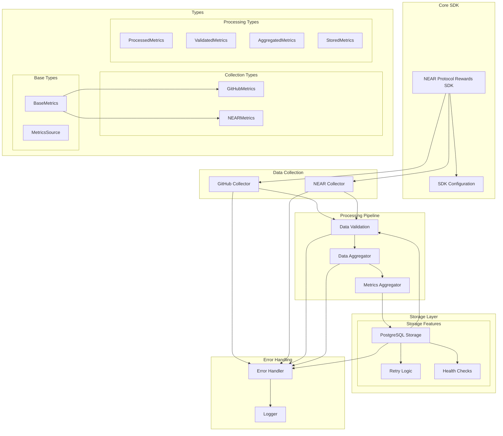

# NEAR Protocol Rewards SDK Architecture

## Key Components

### Core SDK

- SDK initialization and configuration
- Event handling
- Pipeline orchestration

### Data Collection

- GitHub metrics collection with rate limiting
- NEAR transaction metrics collection
- Data validation at source

### Processing Pipeline

- Cross-validation of metrics
- Data aggregation
- Metrics calculation
- Score computation

### Storage Layer

- Transaction management
- Retry logic for resilience
- Data validation before storage
- Health monitoring
- Data cleanup utilities

## Data Flow

1. SDK initializes collectors
2. Collectors gather metrics
3. Validation layer checks data
4. Aggregator processes metrics
5. Storage layer persists data
6. Error handling throughout pipeline
