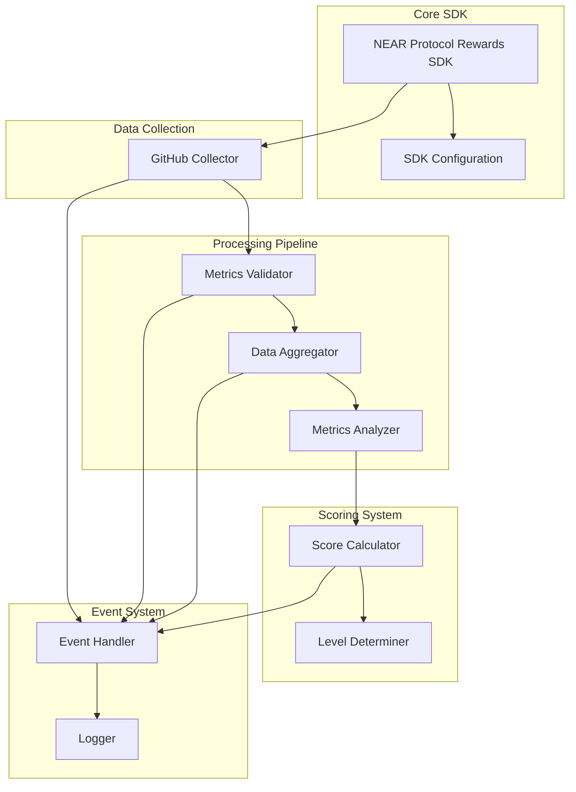

# NEAR Protocol Rewards SDK Architecture



## Component Overview

### Core SDK

- Main SDK class handling initialization and orchestration
- Configuration management and validation
- Event system coordination

### Data Collection

- GitHub API integration with rate limiting
- Metrics collection for commits, PRs, reviews, and issues
- Data normalization and preprocessing

### Processing Pipeline

1. **Metrics Validator**
   - Data format validation
   - Threshold checking
   - Anti-gaming measures

2. **Data Aggregator**
   - Combines metrics from different time periods
   - Calculates running averages
   - Handles data gaps

3. **Metrics Analyzer**
   - Pattern recognition
   - Trend analysis
   - Quality assessment

### Scoring System

1. **Score Calculator**
   - Component score calculation
   - Weight application
   - Total score computation

2. **Level Determiner**
   - Achievement level assignment
   - Progress tracking
   - Milestone detection

### Event System

- Asynchronous event handling
- Real-time metric updates
- Error reporting and logging

## Data Flow

1. **Collection Phase**

   ```typescript
   // GitHub metrics collection
   const metrics = await githubCollector.collect();
   ```

2. **Validation Phase**

   ```typescript
   // Metrics validation
   const validationResult = await validator.validate(metrics);
   ```

3. **Processing Phase**

   ```typescript
   // Metrics processing
   const processed = await aggregator.process(metrics);
   const analyzed = await analyzer.analyze(processed);
   ```

4. **Scoring Phase**

   ```typescript
   // Score calculation
   const score = calculator.calculate(analyzed);
   const level = determiner.determineLevel(score);
   ```

## Error Handling

```typescript
try {
  await collector.collect();
} catch (error) {
  if (error instanceof RateLimitError) {
    // Handle rate limiting
    await rateLimiter.wait();
  } else if (error instanceof ValidationError) {
    // Handle validation errors
    logger.error('Validation failed', error);
  }
}
```

## Event Flow

```typescript
sdk.on('metrics:collected', (metrics) => {
  // Handle new metrics
});

sdk.on('validation:failed', (errors) => {
  // Handle validation failures
});

sdk.on('score:updated', (score) => {
  // Handle score updates
});
```

## Best Practices

1. **Rate Limiting**
   - Respect GitHub API limits
   - Implement exponential backoff
   - Cache frequently accessed data

2. **Error Recovery**
   - Graceful degradation
   - Automatic retry logic
   - Clear error reporting

3. **Data Integrity**
   - Validate all inputs
   - Verify data consistency
   - Handle missing data gracefully

4. **Performance**
   - Efficient API usage
   - Smart caching strategies
   - Batch processing where possible
