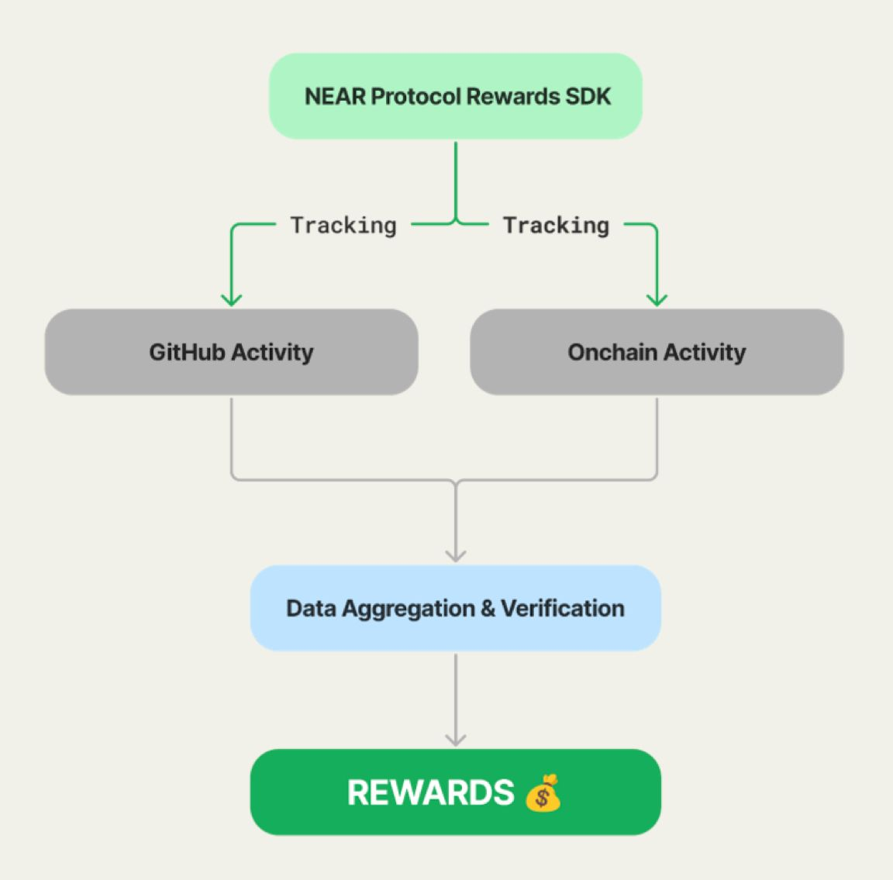

# NEAR Protocol Rewards SDK

> A transparent, metric-based rewards system for NEAR projects that directly ties incentives to development activity.

<div align="center">
  
  [](https://www.npmjs.com/package/near-protocol-rewards)
  [](https://www.typescriptlang.org/)
  [](https://opensource.org/licenses/MIT)
  [](https://github.com/jbarnes850/near-protocol-rewards/blob/main/CONTRIBUTING.md)

</div>

## What is Protocol Rewards?

Protocol Rewards is a developer-first funding solution for the NEAR ecosystem. We're solving a critical challenge in Web3: how to transform traditional one-time grants into sustainable, ongoing capital for developers - where funding automatically grows with their impact and contribution to NEAR.

### The Problem

- Traditional funding models (grants, VCs) require extensive time spent on proposals and pitches
- Developers want to focus on building, not fundraising
- Project impact is often measured subjectively
- Funding is typically front-loaded rather than tied to ongoing development

### Our Solution

Protocol Rewards provides:

- Automated tracking of development metrics and project impact
- Merit-based rewards tied directly to contributions
- Transparent, objective criteria for funding
- Sustainable, ongoing rewards that scale with project growth

By automating the entire process from tracking to distribution, we enable developers to focus on what they do best - building innovative solutions on NEAR.

## Get Started in 30 Seconds

1. Open terminal in your repository
2. Run this command:

```bash
npx near-protocol-rewards init
```

3. Push to main branch

That's it! 🎉 Your metrics will show up at [Protocol Rewards Dashboard](https://near-protocol-rewards.netlify.app/)

## How It Works



We automatically track both off-chain and on-chain metrics:

### Off-Chain Metrics (GitHub)
- **Commits**: How often you code
- **Pull Requests**: How you integrate changes
- **Reviews**: How you help others
- **Issues**: How you manage tasks

### On-Chain Metrics (Blockchain)
- **Transaction Volume**: Total value of transactions
- **Smart Contract Interactions**: Number of unique contract interactions
- **Unique Wallet Interactions**: Number of distinct wallets interacting

Everything runs through GitHub Actions:

- No setup needed
- Uses GitHub's built-in security
- Updates every 12 hours and on push

## Scoring System

The total score (0-100) is calculated from both off-chain (GitHub) and on-chain (Blockchain) contributions, with rewards split 50/50:

### Off-Chain (GitHub) - 50 Points

| Component | Weight | Description | Max Points |
|-----------|--------|-------------|------------|
| Commits | 35% | Code contributions | 17.5 |
| Pull Requests | 25% | Code review and integration | 12.5 |
| Reviews | 20% | Community participation | 10 |
| Issues | 20% | Project management | 10 |

#### Thresholds for Maximum Points (GitHub)
- Commits: 100 meaningful commits → 17.5 points
- Pull Requests: 20 merged PRs → 12.5 points
- Reviews: 30 substantive reviews → 10 points
- Issues: 30 closed issues → 10 points

### On-Chain (Blockchain) - 50 Points

| Component | Weight | Description | Max Points |
|-----------|--------|-------------|------------|
| Transaction Volume | 40% | Total value of transactions | 20 |
| Smart Contract Interactions | 40% | Number of unique interactions | 20 |
| Unique Wallet Interactions | 20% | Number of distinct wallets | 10 |

#### Thresholds for Maximum Points (On-Chain)
- Transaction Volume: $10,000+ in total transactions → 20 points
- Smart Contract Interactions: 500+ interactions → 20 points
- Unique Wallet Interactions: 100+ unique wallets → 10 points

#### Reward Calculation

 Monetary rewards are calculated based on the score, following the table below:

 | Score Range        | Tier     | Monetary Reward |
|--------------------|----------|------------------|
| 90 to 100          | Diamond  | $10,000          |
| 80 to 89           | Platinum | $8,000           |
| 70 to 79           | Gold     | $6,000           |
| 60 to 69           | Silver   | $4,000           |
| 50 to 59           | Bronze   | $2,000           |
| 25 to 49           | Bronze   | $1,000           |
| Below 25           | Member   | $0               |


In the code we have this:
````
Calculates monetary reward based on score."""
    if score >= 90:
        return 10000  # Diamond: $10,000
    elif score >= 80:
        return 8000   # Platinum: $8,000
    elif score >= 70:
        return 6000   # Gold: $6,000
    elif score >= 60:
        return 4000   # Silver: $4,000
    elif score >= 50:
        return 2000   # Bronze: $2,000
    elif score >= 25:
        return 1000   # Bronze: $1,000
    else:
        return 0      # Member: $0
````

## Common Questions

### When do metrics update?

- Every push to main branch
- Every 24 hours automatically
- Check Actions tab for status

### Do I need any tokens?

No! We use GitHub's built-in security.

### Not seeing your metrics?

1. Push something to main branch
2. Wait ~2 minutes for Action to run
3. Check Actions tab for status
4. See our [Troubleshooting Guide](docs/troubleshooting.md)

## Documentation

- [Quick Start Guide](docs/quick-start.md)
- [Troubleshooting Guide](docs/troubleshooting.md)
- [Dashboard Guide](docs/dashboard.md)
- [Rewards Structure](docs/rewards.md)
- [Development Roadmap](docs/roadmap.md)

## Need Help?

- [Report Issues](https://github.com/near-horizon/near-protocol-rewards/issues)
- [Dashboard Support](https://github.com/near-horizon/protocol-rewards-dashboard/issues)

## License

MIT © [NEAR Protocol](LICENSE)
